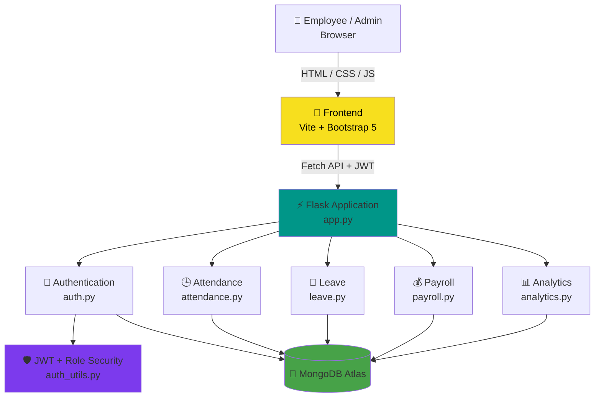
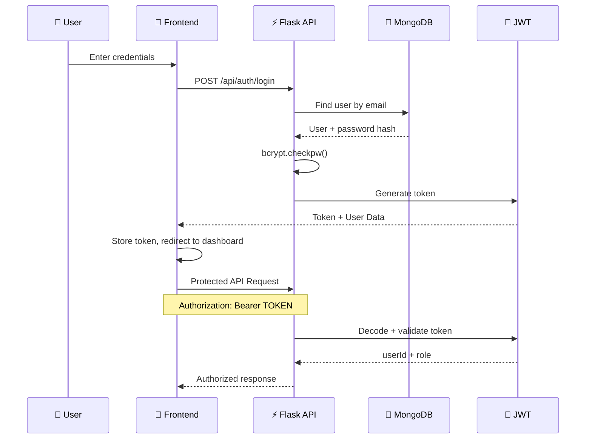
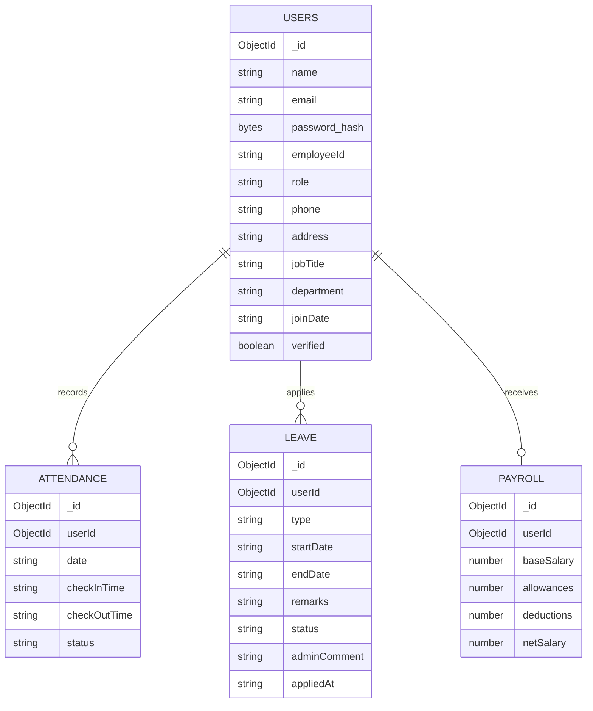

<div align="center">


<p><i>"Every workday, perfectly aligned."</i></p>


<br/>


<br/>


<br/>

[✨ Features](#-key-features) ·
[🏗️ Architecture](#️-system-architecture) ·
[🖼️ Screenshots](#️-screenshots) ·
[📡 API Reference](#-api-reference) ·
[🚀 Quick Start](#-quick-start) ·
[📁 Structure](#-project-structure) ·
[👨‍💻 Developer](#-developer)

</div>

<br/>

## 📌 About

**Dayflow** is a full-stack Human Resource Management System built for modern enterprise workforce operations — secure authentication, role-based dashboards, live attendance tracking, leave workflows, payroll management, and administrative analytics.

The project is split into two independently runnable pieces that talk to each other over a REST API:

| Layer | Stack | Folder |
|---|---|---|
| 🎨 **Frontend** | Semantic HTML5, CSS3, Vanilla JavaScript (ES6+), Bootstrap 5, Chart.js, Vite | `/frontend` |
| ⚙️ **Backend** | Flask, MongoDB Atlas, JWT Authentication, bcrypt | `/backend` |

> ⚠️ **Doc note:** the frontend's `config.js` comments and endpoint list currently reference "Django REST Framework" — the live backend in this repo is **Flask**, not Django. The REST conventions (JSON in/out, `Authorization: Bearer <token>`) are the same either way, so the frontend integrates cleanly, but if you're reading both sub-READMEs standalone, trust this one and the backend doc for stack accuracy.

<div align="center">

</div>

---

## 🖼️ Screenshots

<div align="center">

**🔐 Login — Light & Dark Mode**

 

<br/><br/>

**🧑‍💻 Employee Reports & Analytics**


<br/><br/>

**🛠️ HR Admin Dashboard**


</div>

---

## ✨ Key Features

<table>
<tr>
<td width="50%" valign="top">

### 👤 Employee Portal
- ⏱️ Live workday check-in / check-out widget
- 📅 Personal attendance calendar (daily / 7-day history)
- 🌴 Leave application with instant validation
- 💰 Transparent salary breakdown, read-only payroll view
- 🧾 Printable payslip generator

</td>
<td width="50%" valign="top">

### 🛠️ Admin / HR Portal
- 🔍 Workforce directory with live search & filters
- ➕ Multi-step employee onboarding
- 📊 Org-wide attendance tracker
- ✅ Leave approval triage with mandatory rejection remarks
- 📈 Payroll editor (auto net-salary calc) & analytics dashboard

</td>
</tr>
</table>

<div align="center">

| Feature | Implementation |
|---|---|
| 🔐 JWT Authentication | Login and signup generate secure JWT access tokens |
| 🛡️ Role-Based Access | Protected employee/admin routes via reusable decorators |
| 🔑 Password Hashing | Passwords hashed with `bcrypt` |
| 🕒 Attendance Tracking | One check-in / check-out per employee per day |
| 📝 Leave Workflow | Paid, sick, or unpaid leave with admin approve/reject |
| 💰 Payroll | Base + allowances − deductions = auto net salary |
| 📊 Workforce Analytics | Headcount, attendance %, leave counts, payroll totals |
| ☁️ MongoDB Atlas | Persistent cloud database for all workforce records |
| 🧩 Modular Blueprints | Each domain isolated into its own Flask Blueprint |
| 🌐 CORS Enabled | Frontend and backend run and deploy independently |

</div>

---

## 🏗️ System Architecture



<details>
<summary><b>🔐 Authentication lifecycle (sequence diagram)</b></summary>



</details>

<details>
<summary><b>🗄️ Database schema (entity relationship diagram)</b></summary>



</details>

---

## 📡 API Reference

<details open>
<summary><b>❤️ Health</b></summary>

| Method | Endpoint | Auth | Description |
|:---:|---|:---:|---|
| `GET` | `/` | No | Backend health response |
| `GET` | `/api/health` | No | Service health check |

</details>

<details>
<summary><b>🔐 Authentication</b></summary>

| Method | Endpoint | Access | Description |
|:---:|---|:---:|---|
| `POST` | `/api/auth/signup` | 🌐 Public | Create a user, receive a JWT |
| `POST` | `/api/auth/login` | 🌐 Public | Authenticate, receive a JWT |

</details>

<details>
<summary><b>👤 User Management</b></summary>

| Method | Endpoint | Access | Description |
|:---:|---|:---:|---|
| `GET` | `/api/users/me` | 🔐 User | Get current user profile |
| `PUT` | `/api/users/me` | 🔐 User | Update phone and address |
| `GET` | `/api/users` | 👑 Admin | List employee users |
| `PUT` | `/api/users/<user_id>` | 👑 Admin | Update employee information |

</details>

<details>
<summary><b>🕒 Attendance</b></summary>

| Method | Endpoint | Access | Description |
|:---:|---|:---:|---|
| `POST` | `/api/attendance/checkin` | 🔐 User | Check in for the current day |
| `POST` | `/api/attendance/checkout` | 🔐 User | Check out for the current day |
| `GET` | `/api/attendance/me` | 🔐 User | Get daily attendance |
| `GET` | `/api/attendance/me?range=weekly` | 🔐 User | Get last 7 days attendance |
| `GET` | `/api/attendance` | 👑 Admin | View all attendance |
| `GET` | `/api/attendance?userId=<id>` | 👑 Admin | Filter by employee |
| `GET` | `/api/attendance?date=YYYY-MM-DD` | 👑 Admin | Filter by date |

</details>

<details>
<summary><b>📝 Leave</b></summary>

| Method | Endpoint | Access | Description |
|:---:|---|:---:|---|
| `POST` | `/api/leave` | 🔐 User | Apply for leave |
| `GET` | `/api/leave/me` | 🔐 User | Get personal leave history |
| `GET` | `/api/leave` | 👑 Admin | View all leave requests |
| `GET` | `/api/leave?status=pending` | 👑 Admin | Filter requests by status |
| `PUT` | `/api/leave/<leave_id>/decision` | 👑 Admin | Approve or reject leave |

</details>

<details>
<summary><b>💰 Payroll</b></summary>

| Method | Endpoint | Access | Description |
|:---:|---|:---:|---|
| `GET` | `/api/payroll/me` | 🔐 User | View personal payroll |
| `GET` | `/api/payroll` | 👑 Admin | View all payroll records |
| `PUT` | `/api/payroll/<payroll_id>` | 👑 Admin | Update salary structure |

</details>

<details>
<summary><b>📊 Analytics</b></summary>

| Method | Endpoint | Access | Description |
|:---:|---|:---:|---|
| `GET` | `/api/analytics/summary` | 👑 Admin | Get workforce summary metrics |

</details>

---

## 🧬 Tech Stack

<div align="center">

| Layer | Technology |
|---|---|
| Frontend structure | Semantic HTML5 |
| Frontend styling | CSS3 (custom design system) |
| Frontend logic | Vanilla JavaScript (ES6+, `async/await`) |
| Frontend UI kit | Bootstrap 5 |
| Frontend charts | Chart.js |
| Frontend build tool | Vite |
| Backend framework | Flask 3.0.3 |
| Backend database | MongoDB Atlas (via PyMongo 4.8.0) |
| Backend auth | PyJWT 2.9.0 + bcrypt 4.2.0 |
| Backend CORS | Flask-CORS 4.0.1 |

</div>

---

## 🔑 Demo Access

> Seeded by `backend/seed.py` — this is the source of truth. (The frontend's own mock-mode demo panel uses placeholder credentials that won't match a live backend; use these once `USE_MOCK: false` is set.)

| Role | Email | Password |
|---|---|---|
| 👑 **Admin** | `admin@dayflow.com` | `admin123` |
| 👤 **Employee** | `arjun@dayflow.com` | `pass123` |
| 👤 **Employee** | `sneha@dayflow.com` | `pass123` |

---

## 🚀 Quick Start

### 1️⃣ Clone the repository

```bash
git clone https://github.com/deva2006923/DayFlow.git
cd DayFlow
```

### 2️⃣ Set up the backend

```bash
cd backend
python -m venv venv

# Windows
venv\Scripts\activate
# macOS / Linux
source venv/bin/activate

pip install -r requirements.txt
```

Create a `.env` file in `/backend`:

```env
MONGO_URI=mongodb+srv://<username>:<password>@<cluster>.mongodb.net/dayflow?retryWrites=true&w=majority
JWT_SECRET=change_this_to_a_random_long_string
JWT_EXPIRY_HOURS=24
```

> ⚠️ Never commit your `.env` file or expose your MongoDB credentials and JWT secret.

Seed demo data and start the server:

```bash
python seed.py
python app.py
```

Backend runs at `http://localhost:5000`. Verify with:

```bash
GET http://localhost:5000/api/health
```

### 3️⃣ Set up the frontend

```bash
cd ../frontend
npm install
```

Open `js/config.js` and point it at the live backend:

```javascript
USE_MOCK: false,
API_BASE_URL: 'http://localhost:5000/api'
```

Run the dev server:

```bash
npm run dev
```

Open **`http://localhost:3000`** and log in with the [demo credentials](#-demo-access) above.

---

## 📁 Project Structure

<details>
<summary><b>🎨 Frontend — click to expand</b></summary>

```
frontend/
├── index.html                   # Landing page with demo portal launchers
├── metadata.json                # Application metadata
├── css/
│   ├── style.css                # Design system, CSS variables & typography
│   ├── components.css           # Sidebar, topbar, tables, modals, toasts
│   ├── auth.css                 # Login, signup & verification styles
│   ├── dashboard.css            # Live punch widget, stats grid, timeline
│   ├── employee.css             # Profile banner, calendar, leave balance
│   ├── admin.css                # Action toolbar, approval cards, master tables
│   └── responsive.css           # Mobile & tablet media queries
├── js/
│   ├── config.js                # System constants & API endpoints
│   ├── api.js                   # Mock data store & backend abstraction layer
│   ├── auth.js                  # Auth manager & shared layout injector
│   ├── notifications.js         # Toast engine & notification bell manager
│   ├── dashboard.js             # Live digital clock, punching & Chart.js
│   ├── profile.js               # Profile editor & document downloader
│   ├── attendance.js            # Daily punch logs & monthly calendar view
│   ├── leave.js                 # Leave request form & history
│   ├── payroll.js               # Salary breakdown chart & payslip generator
│   ├── employees.js             # Workforce CRUD controller
│   ├── approvals.js             # HR leave review & triage controller
│   └── reports.js               # HR analytics & report charts
└── pages/
    ├── auth/         # login, signup, verify-email, forgot-password
    ├── employee/      # dashboard, profile, attendance, leave, payroll
    └── admin/         # dashboard, employees, attendance, leave-approvals, payroll, reports
```

</details>

<details>
<summary><b>⚙️ Backend — click to expand</b></summary>

```
backend/
├── app.py            # Flask entry point, CORS, blueprint registration, error handlers
├── db.py             # MongoDB connection and collection access
├── auth.py           # Signup, login, profile, admin employee management
├── auth_utils.py     # JWT generation/validation, token_required, admin_required
├── attendance.py     # Check-in, check-out, daily/weekly history, admin view
├── leave.py          # Apply for leave, personal history, admin approve/reject
├── payroll.py        # Personal payroll, admin list, salary updates + net calc
├── analytics.py      # Workforce analytics summary
├── seed.py           # Demo users, attendance, leaves and payroll
├── requirements.txt  # Python dependencies
└── .env.example      # Environment variable template
```

</details>

---

## 🗺️ Roadmap

- [x] Employee & Admin portal UI
- [x] JWT authentication + bcrypt password hashing
- [x] Role-based access (employee vs admin)
- [x] Attendance check-in/check-out + history
- [x] Leave application + approval workflow
- [x] Payroll calculation and management
- [x] Administrative workforce analytics
- [x] MongoDB Atlas integration
- [ ] Reconcile frontend docs to reference Flask instead of Django REST Framework
- [ ] Automated backend tests
- [ ] API documentation with Swagger / OpenAPI
- [ ] Docker containerization for both services
- [ ] Production deployment configuration

---

<div align="center">

### 👨‍💻 Developer

**Built for DayFlow ⏱️ — a full-stack workforce management system**

[](https://github.com/deva2006923)

### ⭐ If this project helped you, consider starring the repository!

[](https://github.com/deva2006923/DayFlow/stargazers)

<br/>

<sub>Built with Flask ⚡ MongoDB 🍃 JWT 🔐 and Vanilla JS 🎨</sub>

<br/><br/>


</div>
