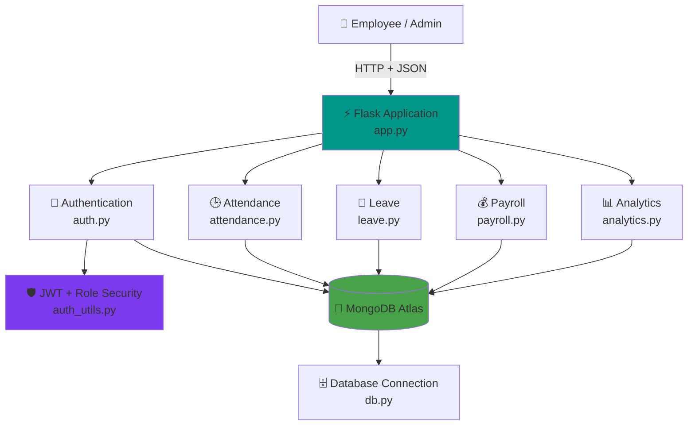
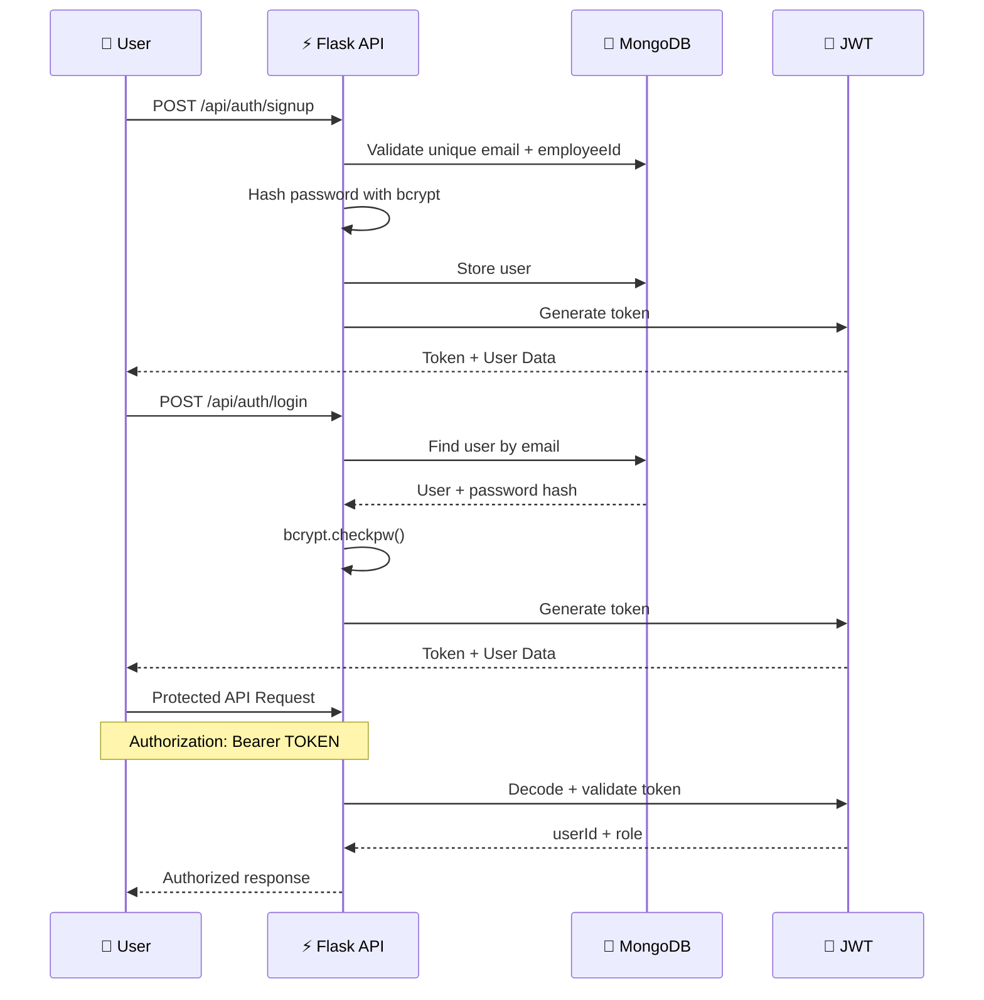
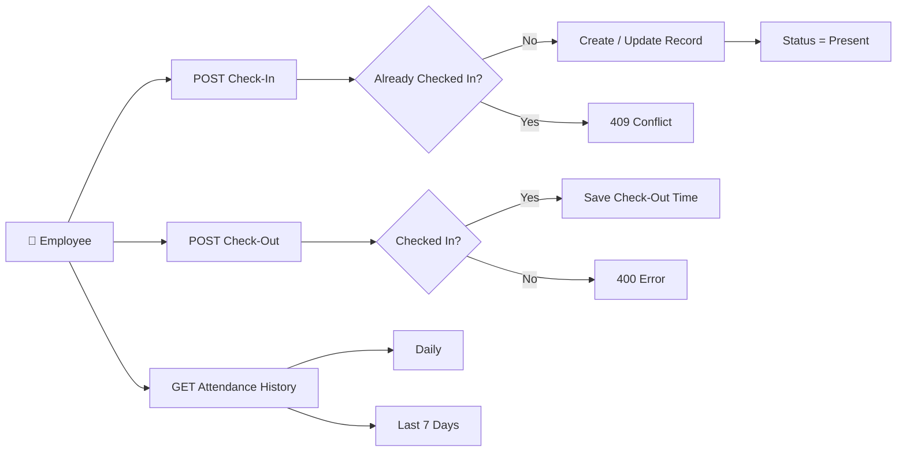
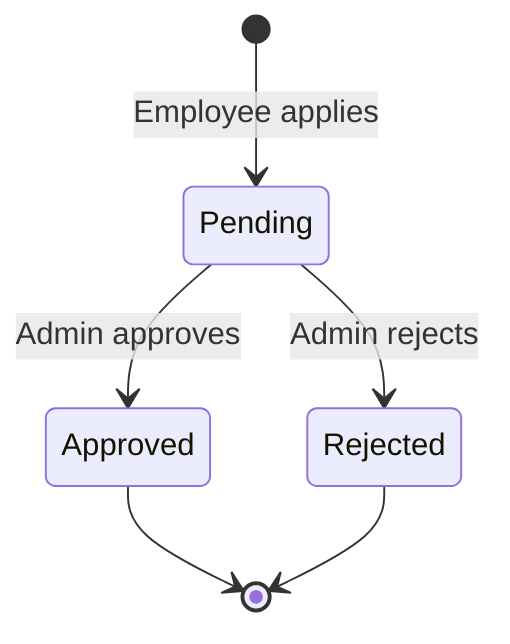
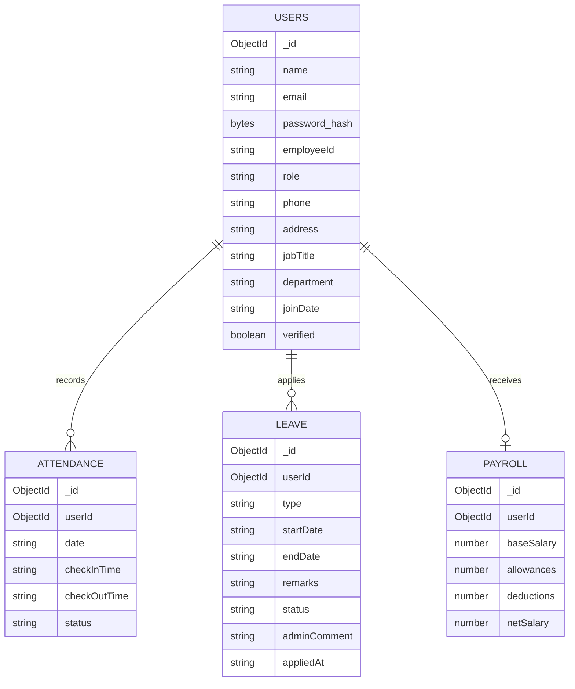

<div align="center">

# ⏱️ DAYFLOW BACKEND

### **Secure Workforce Management REST API**


<br/>


<br/>

> **DayFlow Backend** is a modular REST API for workforce operations.
> It provides **JWT-secured authentication, role-based access control, attendance tracking, leave workflows, payroll management, and administrative analytics** backed by MongoDB Atlas.

<br/>

[✨ Features](#-key-features) ·
[🏗️ Architecture](#️-system-architecture) ·
[🔐 Security](#-authentication--authorization) ·
[📡 API](#-api-reference) ·
[🚀 Quick Start](#-quick-start) ·
[👨‍💻 Developer](#-developer)

</div>

---

<div align="center">

## 📑 Backend Modules

|     🔐 Identity    |      🕒 Workforce      |  📊 Administration  |
| :----------------: | :--------------------: | :-----------------: |
|   Authentication   |       Attendance       |      Analytics      |
|    User Profiles   |    Leave Management    | Employee Management |
|    JWT Security    |  Check-in / Check-out  |  Payroll Management |
| Role Authorization | Daily / Weekly History |   Payroll Summary   |

</div>

---

# ✨ Key Features

<div align="center">

| Feature                          | Implementation                                                    |
| :------------------------------- | :---------------------------------------------------------------- |
| 🔐 **JWT Authentication**        | Login and signup generate secure JWT access tokens                |
| 🛡️ **Role-Based Access**        | Protected employee and admin routes using reusable decorators     |
| 🔑 **Password Hashing**          | Passwords are securely hashed with `bcrypt`                       |
| 👤 **Profile Management**        | Users can retrieve and update their own profile                   |
| 👑 **Admin Employee Management** | Admins can list and update employee information                   |
| 🕒 **Attendance Tracking**       | Employees can check in and check out once per day                 |
| 📅 **Attendance History**        | Personal daily or 7-day attendance history                        |
| 📝 **Leave Workflow**            | Apply for paid, sick, or unpaid leave                             |
| ✅ **Leave Decisions**            | Admins approve or reject pending leave requests                   |
| 💰 **Payroll Management**        | Salary structure with automatic net salary calculation            |
| 📊 **Workforce Analytics**       | Headcount, attendance percentage, leave counts, and payroll total |
| ☁️ **MongoDB Atlas**             | Persistent cloud database for all workforce records               |
| 🧩 **Modular Blueprints**        | Each business domain is isolated into its own Flask Blueprint     |
| 🌐 **CORS Enabled**              | Ready for communication with a separate frontend application      |

</div>

---

# 🏗️ System Architecture



### ⚡ Request Processing Flow

```text
                         ┌─────────────────────┐
                         │   👤 API Client     │
                         │ Employee / Admin    │
                         └──────────┬──────────┘
                                    │
                             HTTP Request
                                    │
                                    ▼
                    ┌───────────────────────────┐
                    │ ⚡ Flask Application      │
                    │         app.py            │
                    └─────────────┬─────────────┘
                                  │
                    ┌─────────────▼─────────────┐
                    │ 🔐 JWT Authentication     │
                    │ 🛡️ Role Authorization    │
                    └─────────────┬─────────────┘
                                  │
              ┌───────────────────┼───────────────────┐
              ▼                   ▼                   ▼
         👤 Auth              🕒 Attendance        📝 Leave
              │                   │                   │
              └───────────────────┼───────────────────┘
                                  │
                       ┌──────────┴──────────┐
                       ▼                     ▼
                  💰 Payroll            📊 Analytics
                       │                     │
                       └──────────┬──────────┘
                                  ▼
                         🍃 MongoDB Atlas
                                  │
                                  ▼
                         📦 JSON Response
```

---

# 🔐 Authentication & Authorization

DayFlow uses **JWT-based authentication** for protected routes.

## Authentication Lifecycle



## 🛡️ Role Protection

```text
                Incoming Request
                       │
                       ▼
               JWT Token Present?
                 │           │
                NO          YES
                 │           │
                 ▼           ▼
             401 Error   Validate JWT
                             │
                       ┌─────┴─────┐
                       ▼           ▼
                    Invalid       Valid
                       │           │
                       ▼           ▼
                   401 Error   Check Role
                                    │
                          ┌─────────┴─────────┐
                          ▼                   ▼
                     👤 Employee          👑 Admin
                          │                   │
                    Employee Routes      Admin Routes
```

### Security Components

| Component        | Purpose                                      |
| :--------------- | :------------------------------------------- |
| `bcrypt`         | Password hashing and password verification   |
| `PyJWT`          | JWT token generation and decoding            |
| `token_required` | Protects routes requiring authentication     |
| `admin_required` | Restricts sensitive routes to administrators |
| JWT Expiry       | Controlled using `JWT_EXPIRY_HOURS`          |

---

# 👤 User & Authentication Module

### `auth.py`

The authentication module handles:

```text
Signup
   │
   ├── Validate required fields
   ├── Validate role
   ├── Check duplicate email
   ├── Check duplicate employee ID
   ├── Hash password with bcrypt
   ├── Create MongoDB user document
   └── Generate JWT token

Login
   │
   ├── Find user by email
   ├── Verify password hash
   └── Generate JWT token

Profile
   │
   ├── GET current user
   └── PUT phone/address

Admin
   │
   ├── List all employees
   └── Update employee details
```

---

# 🕒 Attendance Module

### `attendance.py`

DayFlow stores attendance by employee and date.



### Attendance Logic

* Only **one check-in per employee per day**
* Check-out requires a successful check-in
* Duplicate check-ins and check-outs return `409 Conflict`
* Personal history supports:

  * `daily`
  * `weekly` — last 7 days
* Admins can filter attendance by:

  * `userId`
  * `date`

---

# 📝 Leave Management Module

### `leave.py`

Supported leave types:

```text
💼 PAID LEAVE
🤒 SICK LEAVE
📅 UNPAID LEAVE
```

### Leave Decision Workflow



### Validation

The backend validates:

* Required leave type
* Required start date
* Required end date
* Valid leave type
* `startDate` cannot be after `endDate`
* Admin decisions must be:

  * `approved`
  * `rejected`

Each request stores:

```text
userId
type
startDate
endDate
remarks
status
adminComment
appliedAt
```

---

# 💰 Payroll Module

### `payroll.py`

DayFlow calculates employee net salary automatically.

## 🧮 Salary Formula

```text
NET SALARY
     =
BASE SALARY
     +
ALLOWANCES
     -
DEDUCTIONS
```

### Payroll Update Flow

```text
👑 Admin updates salary components
             │
             ▼
    ┌──────────────────────┐
    │ Validate all values  │
    │ are numeric          │
    └──────────┬───────────┘
               ▼
    base + allowances - deductions
               │
               ▼
       Calculate Net Salary
               │
               ▼
       Update MongoDB Record
               │
               ▼
        Return Updated Payroll
```

Employees can view only their own payroll record, while admins can view and update payroll records.

---

# 📊 Analytics Module

### `analytics.py`

The admin analytics endpoint combines multiple MongoDB collections into a single workforce summary.

```text
GET /api/analytics/summary
             │
             ▼
    ┌───────────────────────────┐
    │     WORKFORCE SUMMARY     │
    ├───────────────────────────┤
    │ 👥 Total Employees        │
    │ 🟢 Present Today          │
    │ 📈 Attendance Percentage  │
    │ 📝 Pending Leaves         │
    │ ✅ Approved Leaves        │
    │ 💰 Total Monthly Payroll  │
    └───────────────────────────┘
```

### Attendance Percentage

```text
Present Employees Today
──────────────────────── × 100
Total Employees
```

---

# 🗄️ Database Architecture

DayFlow connects to MongoDB through `db.py`.



---

# 📡 API Reference

## ❤️ Health

| Method | Endpoint      | Authentication | Description             |
| :----: | :------------ | :------------: | :---------------------- |
|  `GET` | `/`           |       No       | Backend health response |
|  `GET` | `/api/health` |       No       | Service health check    |

---

## 🔐 Authentication

| Method | Endpoint           |   Access  | Description                     |
| :----: | :----------------- | :-------: | :------------------------------ |
| `POST` | `/api/auth/signup` | 🌐 Public | Create a user and receive a JWT |
| `POST` | `/api/auth/login`  | 🌐 Public | Authenticate and receive a JWT  |

---

## 👤 User Management

| Method | Endpoint               |  Access  | Description                 |
| :----: | :--------------------- | :------: | :-------------------------- |
|  `GET` | `/api/users/me`        |  🔐 User | Get current user profile    |
|  `PUT` | `/api/users/me`        |  🔐 User | Update phone and address    |
|  `GET` | `/api/users`           | 👑 Admin | List employee users         |
|  `PUT` | `/api/users/<user_id>` | 👑 Admin | Update employee information |

---

## 🕒 Attendance

| Method | Endpoint                          |  Access  | Description                   |
| :----: | :-------------------------------- | :------: | :---------------------------- |
| `POST` | `/api/attendance/checkin`         |  🔐 User | Check in for the current day  |
| `POST` | `/api/attendance/checkout`        |  🔐 User | Check out for the current day |
|  `GET` | `/api/attendance/me`              |  🔐 User | Get daily attendance          |
|  `GET` | `/api/attendance/me?range=weekly` |  🔐 User | Get last 7 days attendance    |
|  `GET` | `/api/attendance`                 | 👑 Admin | View all attendance           |
|  `GET` | `/api/attendance?userId=<id>`     | 👑 Admin | Filter by employee            |
|  `GET` | `/api/attendance?date=YYYY-MM-DD` | 👑 Admin | Filter by date                |

---

## 📝 Leave

| Method | Endpoint                         |  Access  | Description                     |
| :----: | :------------------------------- | :------: | :------------------------------ |
| `POST` | `/api/leave`                     |  🔐 User | Apply for leave                 |
|  `GET` | `/api/leave/me`                  |  🔐 User | Get personal leave history      |
|  `GET` | `/api/leave`                     | 👑 Admin | View all leave requests         |
|  `GET` | `/api/leave?status=pending`      | 👑 Admin | Filter leave requests by status |
|  `PUT` | `/api/leave/<leave_id>/decision` | 👑 Admin | Approve or reject leave         |

---

## 💰 Payroll

| Method | Endpoint                    |  Access  | Description              |
| :----: | :-------------------------- | :------: | :----------------------- |
|  `GET` | `/api/payroll/me`           |  🔐 User | View personal payroll    |
|  `GET` | `/api/payroll`              | 👑 Admin | View all payroll records |
|  `PUT` | `/api/payroll/<payroll_id>` | 👑 Admin | Update salary structure  |

---

## 📊 Analytics

| Method | Endpoint                 |  Access  | Description                   |
| :----: | :----------------------- | :------: | :---------------------------- |
|  `GET` | `/api/analytics/summary` | 👑 Admin | Get workforce summary metrics |

---

# 📁 Project Structure

```text
dayflow-backend/
│
├── ⚡ app.py
│   ├── Flask application entry point
│   ├── CORS configuration
│   ├── Blueprint registration
│   ├── Health endpoint
│   └── Global 404 / 500 handlers
│
├── 🗄️ db.py
│   └── MongoDB connection and collection access
│
├── 🔐 auth.py
│   ├── Signup
│   ├── Login
│   ├── Get current user
│   ├── Update own profile
│   └── Admin employee management
│
├── 🛡️ auth_utils.py
│   ├── JWT generation
│   ├── JWT validation
│   ├── token_required decorator
│   └── admin_required decorator
│
├── 🕒 attendance.py
│   ├── Check-in
│   ├── Check-out
│   ├── Daily / weekly history
│   └── Admin attendance view
│
├── 📝 leave.py
│   ├── Apply for leave
│   ├── Personal leave history
│   ├── Admin leave view
│   └── Approve / reject workflow
│
├── 💰 payroll.py
│   ├── Personal payroll
│   ├── Admin payroll list
│   └── Salary updates + net calculation
│
├── 📊 analytics.py
│   └── Workforce analytics summary
│
├── 🌱 seed.py
│   └── Demo users, attendance, leaves and payroll
│
├── 📦 requirements.txt
│   └── Python dependencies
│
├── ⚙️ .env.example
│   └── Environment variable template
│
└── 📖 README.md
```

---

# 🚀 Quick Start

## 1️⃣ Clone the Repository

```bash
git clone https://github.com/deva2006923/DayFlow.git
cd DayFlow/backend
```

## 2️⃣ Create a Virtual Environment

```bash
python -m venv venv
```

### Windows

```bash
venv\Scripts\activate
```

### macOS / Linux

```bash
source venv/bin/activate
```

## 3️⃣ Install Dependencies

```bash
pip install -r requirements.txt
```

### Dependencies

```text
Flask 3.0.3
Flask-CORS 4.0.1
PyMongo 4.8.0
python-dotenv 1.0.1
bcrypt 4.2.0
PyJWT 2.9.0
```

---

# ⚙️ Environment Configuration

Create a `.env` file in the backend directory.

```env
MONGO_URI=mongodb+srv://<username>:<password>@<cluster>.mongodb.net/dayflow?retryWrites=true&w=majority

JWT_SECRET=change_this_to_a_random_long_string

JWT_EXPIRY_HOURS=24
```

### Environment Variables

| Variable           | Purpose                            |
| :----------------- | :--------------------------------- |
| `MONGO_URI`        | MongoDB Atlas connection string    |
| `JWT_SECRET`       | Secret used to sign JWT tokens     |
| `JWT_EXPIRY_HOURS` | JWT access token lifetime in hours |

> ⚠️ Never commit your `.env` file or expose your MongoDB credentials and JWT secret.

---

# 🌱 Seed Demo Data

Run:

```bash
python seed.py
```

This clears existing demo data and creates:

```text
👑 1 Admin
👤 2 Employees
🕒 5 Days of Attendance Records
📝 2 Leave Requests
💰 2 Payroll Records
```

### Demo Accounts

| Role        | Email               | Password   |
| :---------- | :------------------ | :--------- |
| 👑 Admin    | `admin@dayflow.com` | `admin123` |
| 👤 Employee | `arjun@dayflow.com` | `pass123`  |
| 👤 Employee | `sneha@dayflow.com` | `pass123`  |

---

# ▶️ Run the Server

```bash
python app.py
```

The backend runs on:

```text
http://localhost:5000
```

Test the health endpoint:

```bash
GET http://localhost:5000/api/health
```

### Response

```json
{
  "status": "ok",
  "service": "dayflow-backend"
}
```

---

# 🧪 Example API Requests

## Create a User

```http
POST /api/auth/signup
Content-Type: application/json
```

```json
{
  "name": "John Doe",
  "email": "john@dayflow.com",
  "password": "securepassword",
  "employeeId": "EMP004",
  "role": "employee"
}
```

---

## Login

```http
POST /api/auth/login
Content-Type: application/json
```

```json
{
  "email": "arjun@dayflow.com",
  "password": "pass123"
}
```

### Response Structure

```json
{
  "token": "<JWT_TOKEN>",
  "user": {
    "id": "<USER_ID>",
    "name": "Arjun Kumar",
    "email": "arjun@dayflow.com",
    "employeeId": "EMP002",
    "role": "employee"
  }
}
```

---

## Check In

```http
POST /api/attendance/checkin
Authorization: Bearer <JWT_TOKEN>
```

---

## Apply for Leave

```http
POST /api/leave
Authorization: Bearer <JWT_TOKEN>
Content-Type: application/json
```

```json
{
  "type": "sick",
  "startDate": "2026-08-25",
  "endDate": "2026-08-26",
  "remarks": "Fever"
}
```

---

## Update Payroll

```http
PUT /api/payroll/<payroll_id>
Authorization: Bearer <ADMIN_JWT_TOKEN>
Content-Type: application/json
```

```json
{
  "baseSalary": 65000,
  "allowances": 8000,
  "deductions": 3000
}
```

The backend calculates:

```text
65000 + 8000 - 3000 = 70000
```

---

# 🛠️ Technology Stack

<div align="center">


</div>

---

# 🔮 Backend Roadmap

* [x] JWT authentication
* [x] bcrypt password hashing
* [x] Employee and admin roles
* [x] Attendance check-in/check-out
* [x] Daily and weekly attendance history
* [x] Leave application workflow
* [x] Admin leave approval/rejection
* [x] Payroll calculation and management
* [x] Administrative workforce analytics
* [x] MongoDB Atlas integration
* [ ] Automated backend tests
* [ ] API documentation with Swagger / OpenAPI
* [ ] Docker containerization
* [ ] Production deployment configuration

---

# 👨‍💻 Developer

<div align="center">

### Built for **DayFlow** ⏱️

**A modular backend for modern workforce management**

<br/>

[](https://github.com/deva2006923)

<br/>

### ⭐ If this backend helped you, consider starring the repository!

[](https://github.com/deva2006923/DayFlow/stargazers)

<br/><br/>

<sub>Built with Flask ⚡ MongoDB 🍃 and JWT 🔐</sub>

</div>

---

<div align="center">

### ⏱️ DAYFLOW BACKEND

**Secure · Modular · Role-Based · API-Driven**

<br/>

Made with ❤️ for workforce management

</div>
